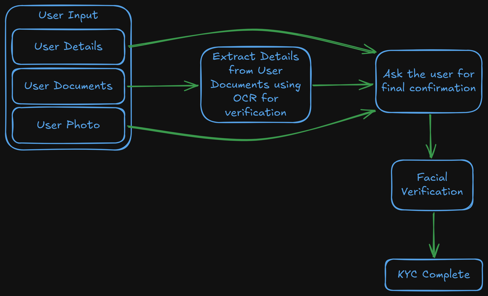
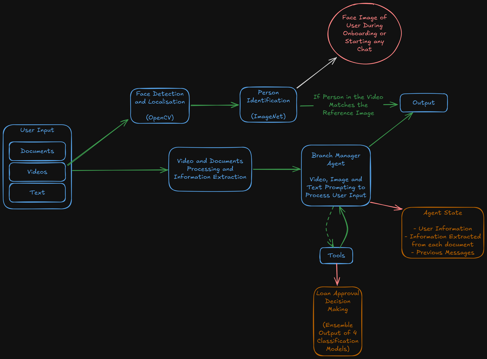

# DigiBANKER

## Video Link 📹

[Drive Link for the Video](https://drive.google.com/drive/folders/1l_ZNeuR8X5DtqIHO55Q4q9COk4aEWFdR?usp=sharing)

## Problem Statement 🛠️

Design an AI-powered Branch Manager that interacts with customers through video-based conversations, guiding them through loan applications, document submission, and eligibility checks. The system should provide a seamless, branch-like experience, ensuring users can apply for loans digitally without visiting a physical bank. This AI-powered Branch Manager will make banking more interactive, accessible, and branch-like, helping users apply for loans digitally with a human-like experience.

## About the Project 📝

DigiBANKER is a virtual AI-based Bank Manager that streamlines the banking experience. The platform guides users through:

1. Complete KYC process step-by-step
2. Video and optional text responses for loan applications
3. Automated processing of financial requests

Developed at the Standard Chartered Hackathon 2025.

## Features 💪🏽

- Guided KYC verification
- Video-based loan application processing
- AI-powered decision making
- Secure document handling
- Real-time application status

## Getting Started 🚀

### Prerequisites

- Node.js (v18 or higher)
- Python 3.9+
- MongoDB

### Frontend Setup

```bash
# Clone the repository
git clone https://github.com/nabhpatodi10/sc-hack.git

# Navigate to frontend directory
cd sc-hack

# Install dependencies
npm install

# Run the development server
npm run start
```

### KYC Backend Setup

```bash
# Navigate to backend directory
cd digibanker/backend

# Create and activate virtual environment
python -m venv venv
source venv/bin/activate  # On Windows: venv\Scripts\activate

# Install dependencies
pip install -r requirements.txt

# Run the API server
python app.py
```


### Branch Manager Agent Backend Setup

```bash
# Navigate to the Agent Directory
cd digibanker/Agent

# Create and activate virtual environment
python -m venv venv
source venv/bin/activate  # On Windows: venv\Scripts\activate

# Install dependencies
pip install -r requirements.txt

# Run the API server
python api.py
```


## Architecture 🧠

The application uses a microservices architecture:
- Frontend: React.js
- KYC Backend: Python Flask
- Agent Backend: Python FastAPI
- Video Processing: OpenCV
- LLMs Used: Google Gemini, OpenAI GPT 4o mini
- Database: MongoDB

## Developed By ⚙️

- [Tanmay Agrawal]
- [Tuhina Tripathi]
- [Pratyush Kumar Singh]
- [Nabh Patodi]
- [Kratika Dariyani]
- [Akanksha Rathore]

## License and Contribution Guidelines 📜


DigiBANKER is under MIT License, Please Read the LICENSE.

We value keeping this site open source, but as you all know, plagiarism is bad. We spent a non-negligible amount of effort developing, designing, and trying to perfect this iteration of our website, and we are proud of it! All we ask is to not claim this effort as your own. So, feel free to fork this repo. If you do, please just give us proper credit.
